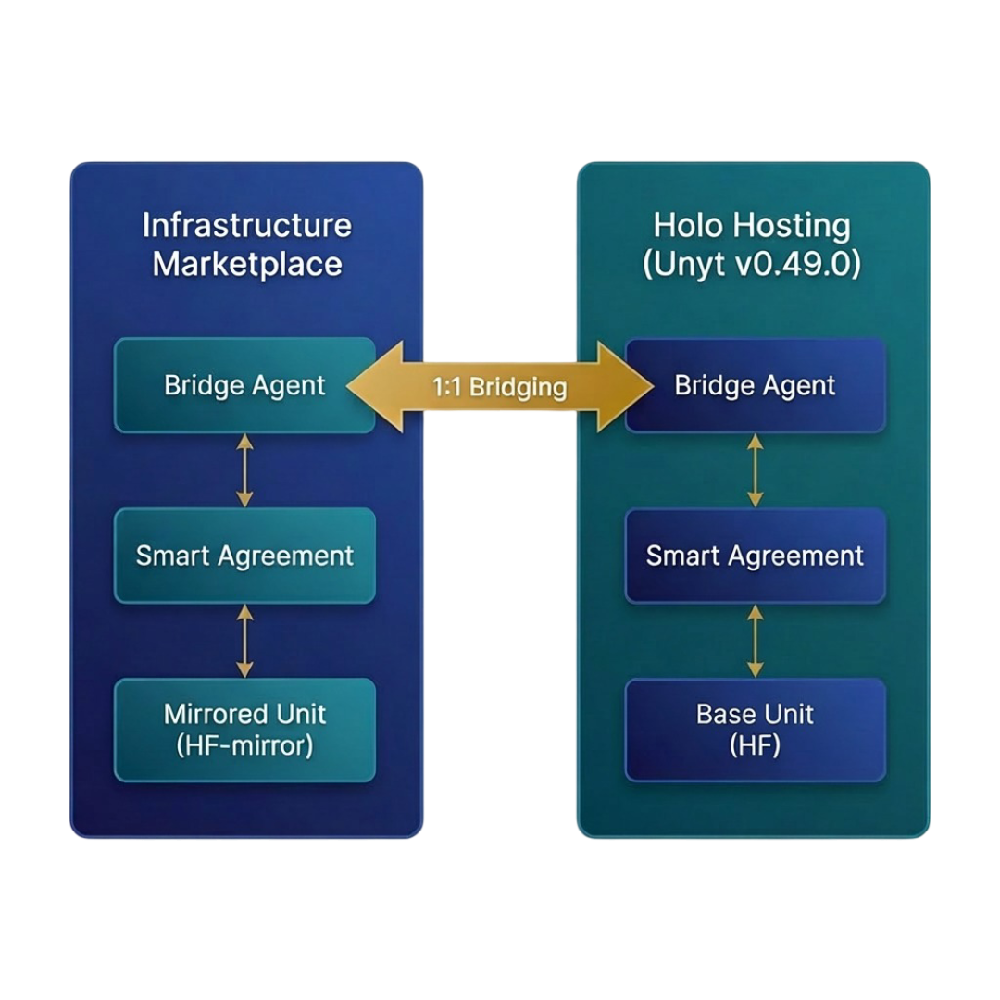

# Unyt Tx5 Releases

## Intro

Unyt is a Holochain based application for creating p2p credit and payment systems with Smart Agreement functionality.

Different groups can each create and run their own Unyt Accounting Application using their own devices.

## This Release
This release demonstrates **unit bridging and mirroring** between independent Unyt Accounting Apps.

Included in the release files are two different Unyt Apps: one is configured to demonstrate how a Holo Hosting accounting app might work with means by which parties could bill and pay for services. The other is configured as an Infrastructure Marketplace. Each is also configured with support for a Unyt Bridge that enables certain units (HF) to be transfered from one to the other.

This release demonstrates a **Unyt implementation of cross-application bridging** using smart agreements that bind internal "mirrored" units to the locking of base units in another network.

### What This Release Demonstrates

This application is purpose-built to demonstrate two capabilities:

1. **Unit Bridging & Mirroring** — Establish a bridging agent with smart agreements that bind internal "mirrored" units of account to "base" units locked in some manner in another digitally signed accounting framework. This release demonstrates interoperability between Unyt Apps using locking by sending to a Unyt Smart Agreement. We are working to support bridging between Unyt Apps and Blockchains, and eventually, TradFi sources with digital signature support.

2. **Bi-Directional Multi-Unit Payments** — Internally, complete single transaction trades involving multiple payment units flowing in both directions. This goes *beyond trading pairs*, enabling true currency market transactions where parties can exchange multiple currencies simultaneously. 

### Key Concepts

- **Unit Bridging:** Lock units in a smart agreement on one network to enable mirrored units on another
- **Mirrored Units:** 1:1 representations of locked units that can be transacted on external networks
- **Smart Agreements:** Programmable contracts that can be used to govern bridging rules and constraints

---

## How Bridging Works

Cross-network transfers operate through a coordinated bridging mechanism using **smart agreements** and Bridge Agents. A smart agreement defines the rules, roles, and unit flows for a transaction.

### Transfer: Holo Hosting → Infrastructure Marketplace

Let's say Alice has HoloFuel (HF) in the Holo Hosting app and wants to transfer 100 HF to her account in Infrastructure Marketplace.

**Step 1: Initiate Transfer**

- Alice opens **Holo Hosting** and navigates to **Transfer Out**
- She selects **HF** as the unit and **Unyt Infrastructure Marketplace** as the destination network
- She enters her **Address from Infrastructure Marketplace** as the destination address
  > 💡 At present, you cannot add external network addresses through the regular address book. This is where external contacts are created — you must create a contact with the destination address from the Transfer Out workflow. 

**Step 2: Submit to the Holo Hosting Bridging Smart Agreement**

- Alice enters the amount (100 HF) and confirms the transfer
- The transaction is submitted to the **bridging smart agreement** on the Unyt Holo Hosting network
- 100 HF is debited from Alice's Unyt Holo Hosting account and that payment is attached to the Unyt Holo Hosting Bridging Smart Agreement.

**Step 3: Bridging Agent Coordination**

- The Bridging Agent on Unyt Holo Hosting executes the Unyt Holo Hosting Bridging Smart Argreement and verifies the locking of the 100 HF
- The Bridging Agent on Unyt Holo Hosting communicates the verified transfer details to the Bridging Agent on Unyt Infrastructure Marketplace

**Step 4: Transfer the Mirrored Unit**

- The bridging agent on **Unyt Infrastructure Marketplace** receives the transfer notification
- It executes the corresponding Smart Agreement on the Infrastructure Marketplace side which adjusts the Bridging Agent's credit limit by 100 HF and allocates 100 HF to Alice.
- Alice's Unyt Infrastructure Marketplace account is notified that she can accept **100 HF** (a mirrored version of the locked Base HF units)

**Step 5: Confirmation**

- Alice sees the incoming transfer appear in her Unyt Infrastructure Marketplace inbox
- She accepts the transaction, and her balance gets credited +100 HF (mirrored)

*Since this is really just accounting, technically, the HF units in the Infrastructure Marketplace App are Mirrored HF, but since the other units are locked and these are 1:1, it is simpler to just refer to them also as HF. This is similar to how blockchain L2 Tokens typically use the same name as the L1 token.

---

### Transfer: Unyt Infrastructure Marketplace → Unyt Holo Hosting

Now Alice wants to send 50 HF back from Unyt Infrastructure Marketplace to Holo Hosting.

**Step 1: Initiate Transfer In**

- Alice opens **Unyt Infrastructure Marketplace** and navigates to **Transfer Out**
- She selects **HF** as the unit and **Holo Hosting** as the destination network
- She enters her **Address from Holo Hosting** as the destination address

**Step 2: Submit to the Infra Bridging Smart Agreement**

- Alice enters the amount (50 HF) and confirms
- Alice's Unyt Infrastructure Marketplace account gets debited 50 HF
- The 50 HF are attached to the Unyt Infra Bridging Smart Agreement

**Step 3: Bridging Agent Coordination**

- The Bridging Agent on Unyt Infrastructure Marketplace executes the Smart Agreement
- It then signals the Unyt Holo Hosting bridging agent with the verified transfer details

**Step 4: Release from Reserve**

- The Bridging Agent on **Unyt Holo Hosting** executes the return smart agreement
- 50 HF is allocated from the Smart Agreement to Alice's Unyt Holo Hosting account

**Step 5: Confirmation**

- Alice sees the incoming transfer in her Unyt Holo Hosting inbox
- Upon acceptance, her Unyt Holo Hosting balance reflects +50 HF

**Note:** Rules and constraints can be put in place to control the flow of transactions across any particular bridge. Those are determined by the Bridging Smart Agreements on either side of a bridge.

---
> ⚠️ **Contacts for external networks must be created during the Transfer In or Transfer Out process.** The standard address book only supports adding contacts within the same Unyt network. When you initiate a cross-network transfer, you'll be prompted to select one that you have previously saved or enter and save the destination address. This is the only way to establish a contact on an external network.

Also check out the [Unyt Bridging: Connecting Value Networks](https://unyt.co/blog/unyt-bridging:-connecting-value-networks/) blog post.

Feel free to join the conversation in the Unyt Thread on the [Holochain DEV.HC Discord](https://discord.com/invite/k55DS5dmPH).

The Unyt Channel is here:
https://discordapp.com/channels/919686143581253632/1425157240972902430

How to give yourself access?

1. Go to the '#👤・5・select-a-role'' Channel
2. Assign yourself the ''Access to: Projects'' role
3. In the category ''Projects'' go to the channel called ''Unyt"

For those that want to go a bit deeper, we'd like you to test the usability of custom Smart Agreement configurations and system features.

- create and test service units relevant to your network.
- aggregate receives via a Smart Agreement RAVE (e.g. process bulk invoices via a log collector with a single payment)
- aggregate sends via a Smart Agreement RAVE (e.g. collection of transaction fees)

## Downloads

Select from two versions of apps to download.

1. The **Full-Arc** verson holds a full copy of the DHT locally, synchronizing all data being published.
2. The **Zero-Arc** version is lighter weight to run (which will be good for mobile phones, for example) because only holds your own history, and caches some other network data, but some actions will be slower because you'll need to fetch data from peers on the network.

---

### Holo Hosting

#### Zero-Arc Releases

<table>
<tr>
<td width="33%" align="center">

##### **Windows**

---

[MSI Installer (x64)](https://github.com/unytco/unyt-sandbox-tx5/releases/download/v0.50.0-rc.4/unyt_0.50.0-rc.4_Holo.Hosting_0-arc_x64_windows.msi)

[EXE Setup (x64)](https://github.com/unytco/unyt-sandbox-tx5/releases/download/v0.50.0-rc.4/unyt_0.50.0-rc.4_Holo.Hosting_0-arc_x64_windows.exe)

</td>
<td width="25%" align="center">

##### **MacOS**

---

[Silicon (arm64)](https://github.com/unytco/unyt-sandbox-tx5/releases/download/v0.50.0-rc.4/unyt_0.50.0-rc.4_Holo.Hosting_0-arc_aarch64_darwin.dmg)

[Intel (x64)](https://github.com/unytco/unyt-sandbox-tx5/releases/download/v0.50.0-rc.4/unyt_0.50.0-rc.4_Holo.Hosting_0-arc_x64_darwin.dmg)

</td>
<td width="25%" align="center">

##### **Linux**

---

[AppImage](https://github.com/unytco/unyt-sandbox-tx5/releases/download/v0.50.0-rc.4/unyt_0.50.0-rc.4_Holo.Hosting_0-arc_amd64_linux.AppImage)

[Debian (.deb)](https://github.com/unytco/unyt-sandbox-tx5/releases/download/v0.50.0-rc.4/unyt_0.50.0-rc.4_Holo.Hosting_0-arc_amd64_linux.deb)

</td>
</tr>
</table>

#### Full-Arc Releases

<table>
<tr>
<td width="33%" align="center">

##### **Windows**

---

[MSI Installer (x64)](https://github.com/unytco/unyt-sandbox-tx5/releases/download/v0.50.0-rc.4/unyt_0.50.0-rc.4_Holo.Hosting_default-arc_x64_windows.msi)

[EXE Setup (x64)](https://github.com/unytco/unyt-sandbox-tx5/releases/download/v0.50.0-rc.4/unyt_0.50.0-rc.4_Holo.Hosting_default-arc_x64_windows.exe)

</td>
<td width="25%" align="center">

##### **MacOS**

---

[Silicon (arm64)](https://github.com/unytco/unyt-sandbox-tx5/releases/download/v0.50.0-rc.4/unyt_0.50.0-rc.4_Holo.Hosting_default-arc_aarch64_darwin.dmg)

[Intel (x64)](https://github.com/unytco/unyt-sandbox-tx5/releases/download/v0.50.0-rc.4/unyt_0.50.0-rc.4_Holo.Hosting_default-arc_x64_darwin.dmg)

</td>
<td width="25%" align="center">

##### **Linux**

---

[AppImage](https://github.com/unytco/unyt-sandbox-tx5/releases/download/v0.50.0-rc.4/unyt_0.50.0-rc.4_Holo.Hosting_default-arc_amd64_linux.AppImage)

[Debian (.deb)](https://github.com/unytco/unyt-sandbox-tx5/releases/download/v0.50.0-rc.4/unyt_0.50.0-rc.4_Holo.Hosting_default-arc_amd64_linux.deb)

</td>
</tr>
</table>

---

### Infrastructure Marketplace

#### Zero-Arc Releases

<table>
<tr>
<td width="33%" align="center">

##### **Windows**

---

[MSI Installer (x64)](https://github.com/unytco/unyt-sandbox-tx5/releases/download/v0.50.0-rc.4/unyt_0.50.0-rc.4_Infrastructure.Marketplace_0-arc_x64_windows.msi)

[EXE Setup (x64)](https://github.com/unytco/unyt-sandbox-tx5/releases/download/v0.50.0-rc.4/unyt_0.50.0-rc.4_Infrastructure.Marketplace_0-arc_x64_windows.exe)

</td>
<td width="25%" align="center">

##### **MacOS**

---

[Silicon (arm64)](https://github.com/unytco/unyt-sandbox-tx5/releases/download/v0.50.0-rc.4/unyt_0.50.0-rc.4_Infrastructure.Marketplace_0-arc_aarch64_darwin.dmg)

[Intel (x64)](https://github.com/unytco/unyt-sandbox-tx5/releases/download/v0.50.0-rc.4/unyt_0.50.0-rc.4_Infrastructure.Marketplace_0-arc_x64_darwin.dmg)

</td>
<td width="25%" align="center">

##### **Linux**

---

[AppImage](https://github.com/unytco/unyt-sandbox-tx5/releases/download/v0.50.0-rc.4/unyt_0.50.0-rc.4_Infrastructure.Marketplace_0-arc_amd64_linux.AppImage)

[Debian (.deb)](https://github.com/unytco/unyt-sandbox-tx5/releases/download/v0.50.0-rc.4/unyt_0.50.0-rc.4_Infrastructure.Marketplace_0-arc_amd64_linux.deb)

</td>
</tr>
</table>

#### Full-Arc Releases

<table>
<tr>
<td width="33%" align="center">

##### **Windows**

---

[MSI Installer (x64)](https://github.com/unytco/unyt-sandbox-tx5/releases/download/v0.50.0-rc.4/unyt_0.50.0-rc.4_Infrastructure.Marketplace_default-arc_x64_windows.msi)

[EXE Setup (x64)](https://github.com/unytco/unyt-sandbox-tx5/releases/download/v0.50.0-rc.4/unyt_0.50.0-rc.4_Infrastructure.Marketplace_default-arc_x64_windows.exe)

</td>
<td width="25%" align="center">

##### **MacOS**

---

[Silicon (arm64)](https://github.com/unytco/unyt-sandbox-tx5/releases/download/v0.50.0-rc.4/unyt_0.50.0-rc.4_Infrastructure.Marketplace_default-arc_aarch64_darwin.dmg)

[Intel (x64)](https://github.com/unytco/unyt-sandbox-tx5/releases/download/v0.50.0-rc.4/unyt_0.50.0-rc.4_Infrastructure.Marketplace_default-arc_x64_darwin.dmg)

</td>
<td width="25%" align="center">

##### **Linux**

---

[AppImage](https://github.com/unytco/unyt-sandbox-tx5/releases/download/v0.50.0-rc.4/unyt_0.50.0-rc.4_Infrastructure.Marketplace_default-arc_amd64_linux.AppImage)

[Debian (.deb)](https://github.com/unytco/unyt-sandbox-tx5/releases/download/v0.50.0-rc.4/unyt_0.50.0-rc.4_Infrastructure.Marketplace_default-arc_amd64_linux.deb)

</td>
</tr>
</table>

---

All available versions can be found in the [Releases](https://github.com/unytco/unyt-sandbox-tx5/releases/)

Once installed, the Unyt software will run locally on your device and connect with others also running the software to operate as a peer-to-peer application.

## Setup

Note: In Mac, because you downloaded the software directly and not through Apple's App Store, you may need to open the System Settings and go to Privacy and Security, scroll down to Security and give Unyt permission to run.

If you want to delete everything and start over with a new account, check out [Starting Fresh](./testing_docs/starting_fresh.md)

When you open Unyt on your operating system for the first time, it will create a set of public and private keys for you that you can use to interact with others. These are stored in a private keystore (Lair) on your own machine and are used during future uses. In Unyt we often refer to this public key as "your address" as it is how others can refer to you when sending, receiving or authorizing you to perform particular roles.

## Related Resources

- [Unyt Setup](./README.md)
- [Detailed Documentation](./testing_docs/5_0_phase_5_testing_details.md)
- [Unyt Dictionary](./testing_docs/4_2_unyt-dictionary.md)
- [The Smart Agreement Overview](./testing_docs/5_0_Smart_Agreement_Release.md)
- [Intro to Smart Agreements (Three Layers)](./testing_docs/4_1_intro_to_smart_agreements.md)
- [Templates and Smart Agreements Library Repo](https://github.com/unytco/smart_agreement_library)
- [Smart Agreement Release v.0.40.0 README](./testing_docs/archived_readme_files/5_0_Smart_Agreements_README.md_5_0_Smart_Agreements_README.md)
- [Rideshare Release v.0.42.0 README](./testing_docs/archived_readme_files/7_0_rideshare_README.md)
- [Feedback](https://github.com/orgs/unytco/projects/5/views/1)

## License

This project is licensed under the terms specified in the [LICENSE](LICENSE) file.

Copyright (C) 2024 - 2025, unyt.co
